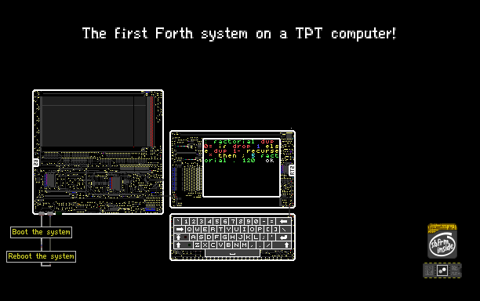

# A Forth for the R216 computer



## What?
This project aims to implement the Forth programming language on the
[R216 computer by LBPHacker](https://lbphacker.pw/powdertoy/R216/manual.md).  The
computer is implemented completely in the video game [Powder
Toy](https://powdertoy.co.uk/), so this Forth will be one of the few
systems out there that target a fictional computer.  Since Forth is
extremely easy to port, it only takes a couple of primitive routines
to get started writing the whole thing again.

This is the first system I know of in Powder Toy that allows
interactive programming within Powder Toy itself (i.e. without needing
an assembler), and the first non-assembly language to be ported to a
Powder Toy computer.

The default program `forth.asm` reads up to 128 characters of input,
then starts the interpreter up, which performs the standard Forth loops
until a `NUL` byte is read.  The interpreter echos back what it's
reading for debugging purposes, according to the following table.

| Color  | Meaning                 |
| :-:    | :-:                     |
| Green  | Interpreted             |
| Red    | Compiled                |
| Yellow | Interpreted (immediate) |
| Blue   | Compiled number         |
| Cyan   | Interpreted number      |

Here are some example programs that you can type at the REPL.
```forth
." hello, world!"
\ => hello, world ok

: stars 0 do star loop ;
10 stars
\ => ********** ok

: factorial dup 0= if drop 1 else dup 1- recurse * then ;
5 factorial .
\ => 120 ok
```

Here is a list of words defined in the system.
```
s0 sp@ depth .s decimal hex latest base xor and find allot here c@ c!
@ !  , +!  -!  >r r> /mod nip mod div space create immed ?immed hide [
] : ; constant value to .  d.  u.  ?dup < > = 0<> 0= <> dup 2dup drop
2drop swap over rot + - * um* 1- 1+ 2- 2+ number max min word /mod
origin page emit >dfa >cfa execute recurse puts lit tell s" ."  halt
(') ' if else then begin until again while j i repeat do loop +loop
star
```

## Features
- The first Forth system for a TPT computer; 75 words and counting
  - An extensible, lightweight, interactive, introspective language.
- Harnesses the 16-bit power of the R216 computer, with features such
  as
  - 16-bit multiplication (16 * 16 -> 16 bit or 16 * 16 -> 32 bit)
  - Terminal output/input (can be generalized to other peripherals)
- Adapts to memory layout, can be flashed on the 4K or 8K variant of
  the R216

### Quirks
- Only the first three characters and length are checked when
  traversing the dictionary (this was actually the case in older Forth
  systems such as the one used in _Starting Forth_)
- **Runs slowly**: increase the frame rate by running `tpt.setfpscap(2)`
  unless you're prepared to wait minutes for simple programs

## Why?
Fictional computers are great.  One can learn a lot from both
implementing and playing around with them.  But when was the last time
you saw a Forth REPL in fictional computer?  What about a Forth REPL
in a fictional computer implemented in a powder simulation game?
Well, now you have!  From the relative success of my [previous
project](https://github.com/siraben/zkeme80), a Forth-based operating
system for TI-84+ calculators, I thought it would be fun to write
another one.  From initially knowing nothing about the architecture,
Within two days I got a REPL working with compile/interpret states,
and now it's just a matter of porting all the other Forth words we
know and love.

## Building and running R216 Forth
Ensure you have a recent version of Powder Toy (tested on version
94.1).

Clone [the assembler](https://github.com/LBPHacker/R216) and this
repository using Git.  Open the file `r216-forth.cps` in Powder Toy, you'll
see a computer, screen and keyboard.  Open the Lua console by pressing
~ and type the following:

```lua
r2asm = loadfile("<path to repo>/r2asm.lua")
```

Where `<path to assembler repo>` is the absolute path to the cloned assembler.
Then, type in

```lua
a = "<path to this repo>/forth.asm"
```

To define a variable `a` to shorten lines (Powder Toy truncates long
commands).  Finally, you can assemble `forth.asm` by running:

```lua
r2asm(a, 0xDEAD, "<path to logfile>")
```

Where `<path to logfile>` is the path to a log file which you can open
to see if the assembling worked.  Close the console by pressing ~, and
click on the sign to begin using R216 Forth!

## Future plans
- [x] Add ability to read numbers
  - [x] Relies on multiplication routine
- [x] Add string words `."`, `s"`
- [x] Add exceptions, `catch`, `throw`
- [ ] Add `?do`, fix `leave`
  - [ ] Requires rewriting implementation of `do`, `loop` and `+loop`
  
